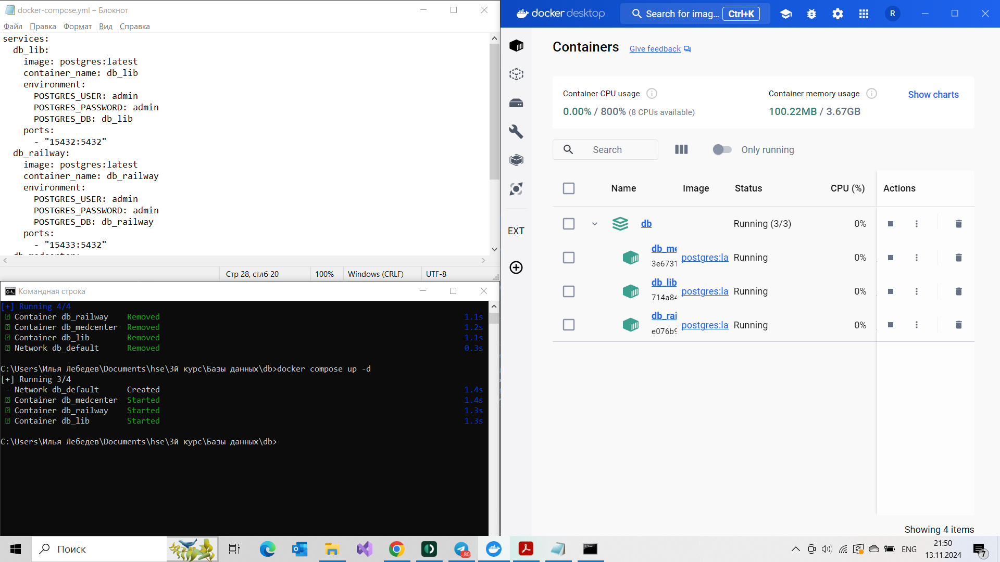
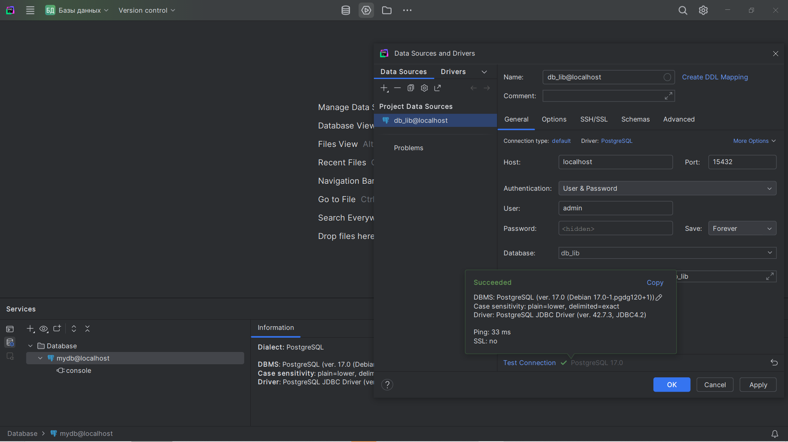
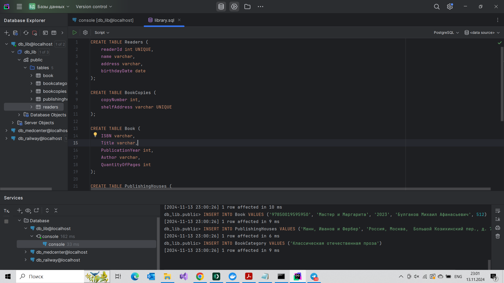
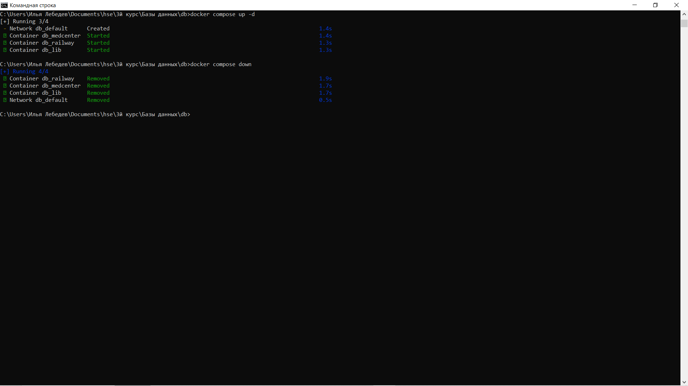
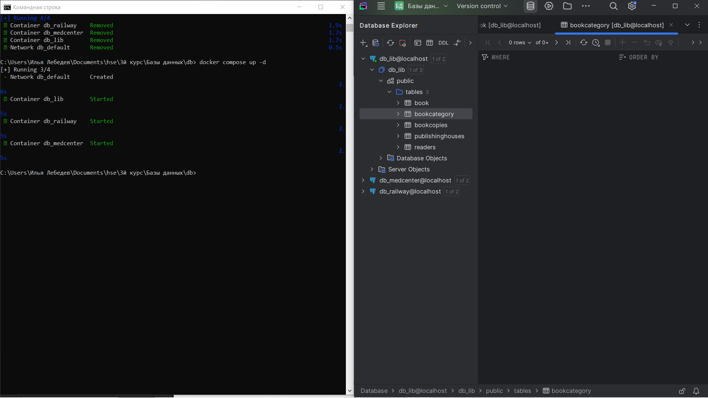

# HW4

Создан docker-compose файл с тремя сервисами PostgreSQL и запущены контейнеры. 

Через DataGrip удалось подключиться к БД.

SQL запросами (В папке SQL) были созданы таблицы и загружены данные.

Контейнеры были удалены.

После повторного запуска и подключения к DataGrip можно наблюдать, что данные не сохранились, т.к. не были использованы volumes.