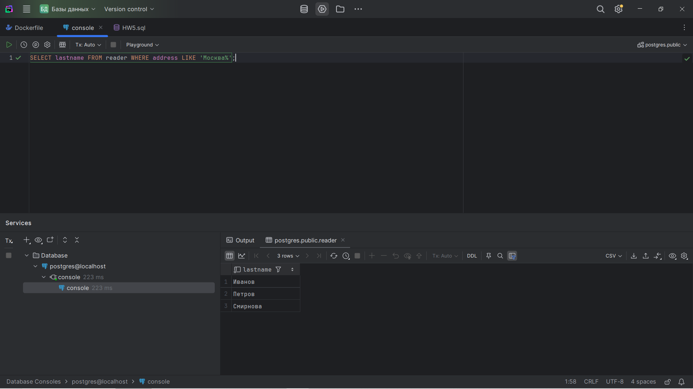
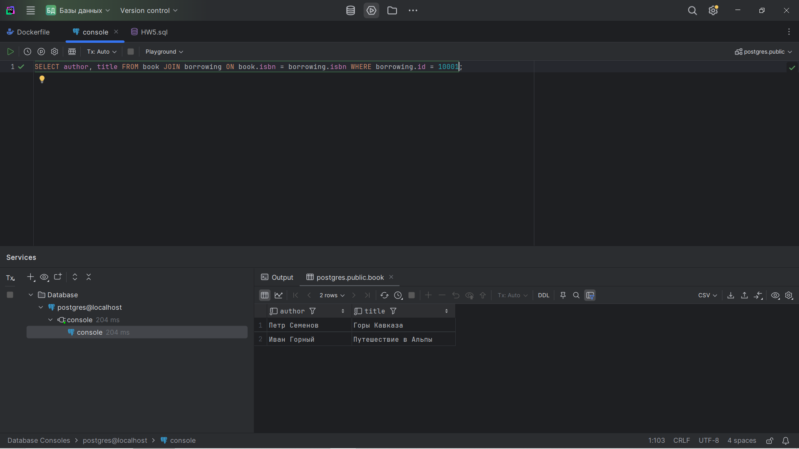
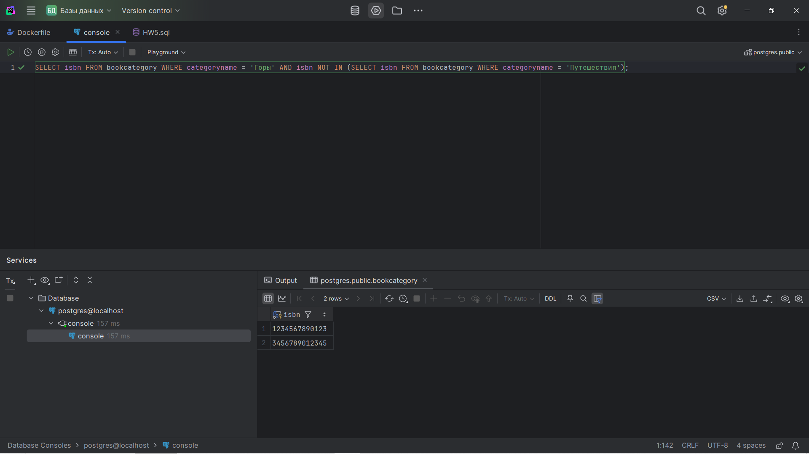
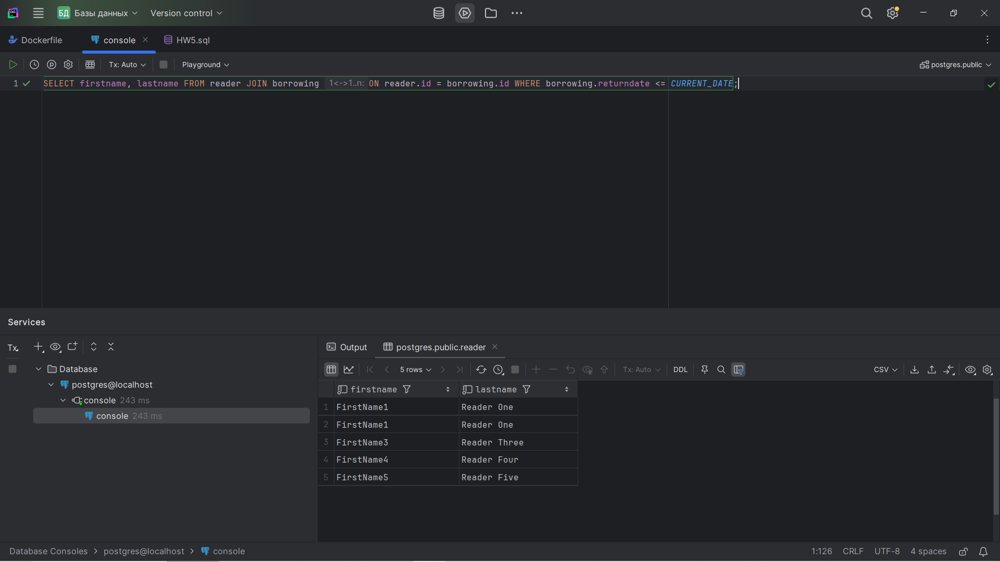
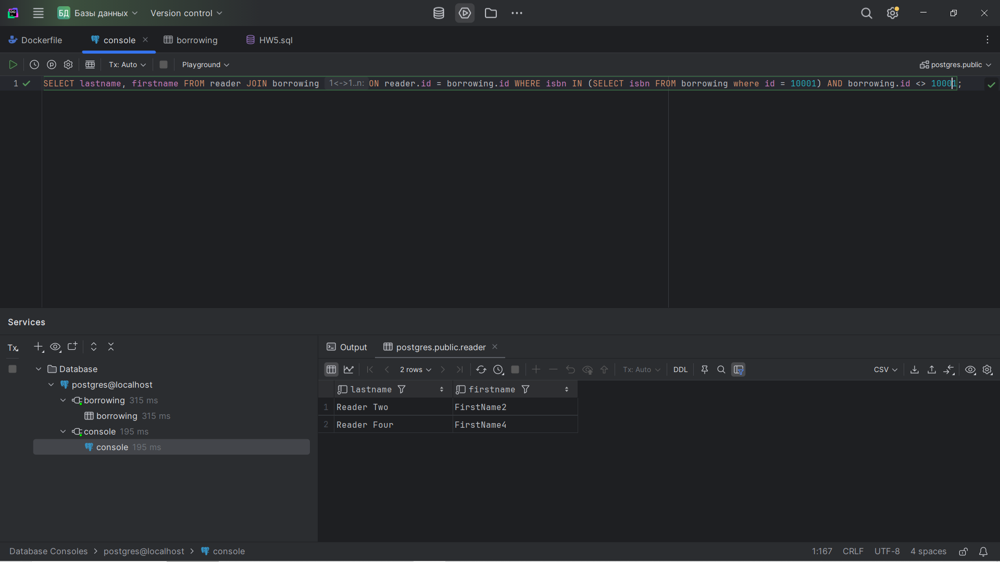
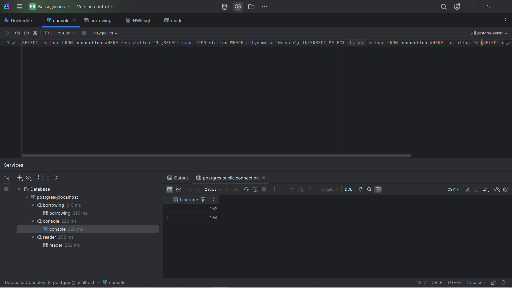
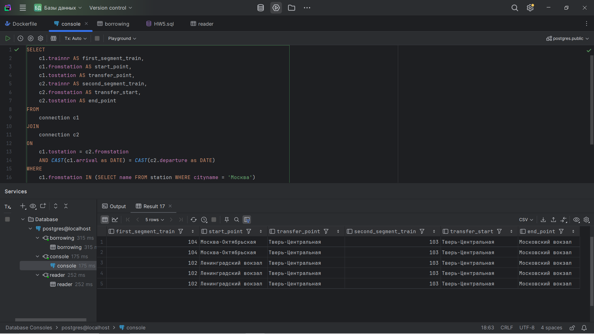

# HW5
В этой работе я написал SQL-запросы для следующих вопросов:
#### 1. Какие фамилии читателей в Москве?
```
SELECT lastname FROM reader WHERE address LIKE 'Москва%';
```


#### 2. Какие книги (author, title) брал Иван Иванов?
```
SELECT author, title FROM book JOIN borrowing ON book.isbn = borrowing.isbn WHERE borrowing.id = 10000;
```

*В тестовых данных не было книг, которые брал Иван Иванов, поэтому он был заменен на Reader One.*

#### 3. Какие книги (ISBN) из категории "Горы" не относятся к категории "Путешествия"? 
```
SELECT isbn FROM bookcategory WHERE categoryname = 'Горы' AND isbn NOT IN (SELECT isbn FROM bookcategory WHERE categoryname = 'Путешествия');
```


#### 4. Какие читатели (LastName, FirstName) вернули копию книги?
```
SELECT firstname, lastname FROM reader JOIN borrowing ON reader.id = borrowing.id WHERE borrowing.returndate <= CURRENT_DATE; 
```


#### 5. Какие читатели (LastName, FirstName) брали хотя бы одну книгу (не копию), которую брал также Иван Иванов (не включайте Ивана Иванова в результат)?
```
SELECT lastname, firstname FROM reader JOIN borrowing ON reader.id = borrowing.id WHERE isbn IN (SELECT isbn FROM borrowing where id = 10000) AND borrowing.id <> 10000;
```

*В тестовых данных не было книг, которые брал Иван Иванов, поэтому он был заменен на Reader One.*

#### 6. Найдите все прямые рейсы из Москвы в Тверь.
```
SELECT trainnr FROM connection WHERE fromstation IN (SELECT name FROM station WHERE cityname = 'Москва') INTERSECT SELECT trainnr FROM connection WHERE tostation IN (SELECT name FROM station WHERE cityname = 'Тверь')
```


#### 7. Найдите все многосегментные маршруты, имеющие точно однодневный трансфер из Москвы в Санкт-Петербург 
```
SELECT
    c1.trainnr AS first_segment_train,
    c1.fromstation AS start_point,
    c1.tostation AS transfer_point,
    c2.trainnr AS second_segment_train,
    c2.fromstation AS transfer_start,
    c2.tostation AS end_point
FROM
    connection c1
JOIN
    connection c2
ON
    c1.tostation = c2.fromstation
    AND CAST(c1.arrival as DATE) = CAST(c2.departure as DATE)
WHERE
    c1.fromstation IN (SELECT name FROM station WHERE cityname = 'Москва')
    AND c2.tostation IN (SELECT name FROM station WHERE cityname = 'Санкт-Петербург')
    AND cast(c1.departure as DATE) = cast(c2.arrival as DATE);

```

